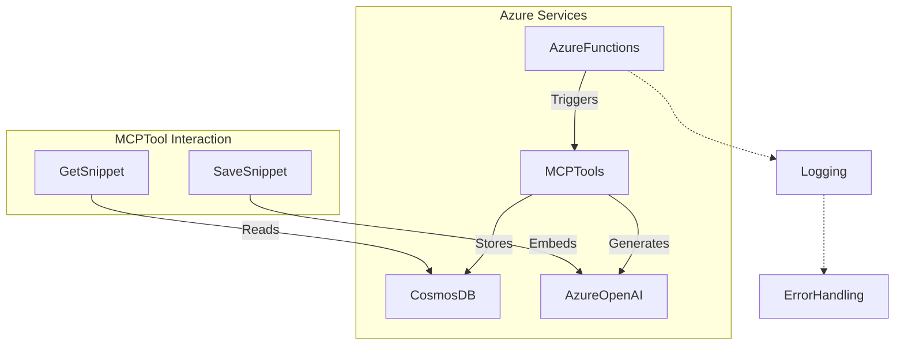
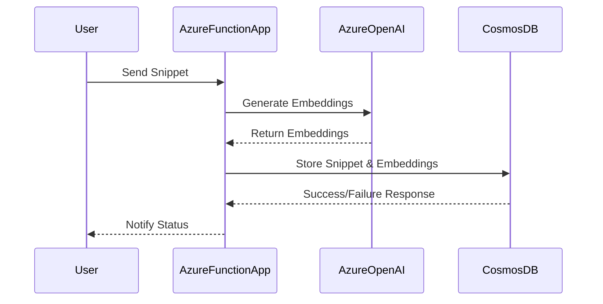

# Project Overview

This project is centered around the MCP (Model Context Protocol) tools designed for use with Azure Functions and AI-powered operations. The tools enable seamless integration with Azure OpenAI, Cosmos DB, and AI Agents to manage and analyze code snippets. Key functionalities include document management, vector search, error handling, logging, and provisioned cloud infrastructure using Bicep templates.

## Major Concepts

### MCP Tools

MCP tools automate operations related to code snippets using triggers that respond to Azure Function events. Tools such as `save_snippet`, `get_snippet`, `deep_wiki`, and `code_style` interact with various Azure services to provide a robust solution for code documentation and analysis.

### Azure Functions

Azure Functions provide the backbone for serverless execution, handling multiple types of triggers including HTTP and custom MCP triggers. The project leverages Azure Functions to perform backend operations with minimal infrastructure overhead.

### Cosmos DB & Vector Search

Cosmos DB is employed for document storage, utilizing its ability to handle JSON data. The integration includes vector search capabilities to enhance the retrieval process using embeddings generated by Azure OpenAI.

### Azure OpenAI

The project uses Azure OpenAI for advanced AI operations, particularly embedding text for vector-based searches and analysis. This enables intelligent handling and querying of code snippets.

### Error Handling & Logging

Error handling in the project is robust, utilizing Python's exception handling capabilities. Logging is crucial for diagnostics and is employed throughout the code to track operations and errors.

### Bicep Templates

Azure Bicep is used to define infrastructure as code, setting up Azure resources required for the operation of MCP tools. This involves complex parameter definitions and resource orchestration.

## Diagram Visualizations

### System Architecture



### Data Flow



## Snippet Catalog

| Snippet ID               | Language    | Purpose                                           |
|--------------------------|-------------|---------------------------------------------------|
| snip-func                | Python      | MCP tool trigger for saving snippets              |
| func-app-snippy          | Python      | Demonstrates Azure Functions with multiple services|
| main-bicep               | Bicep       | Infrastructure as code for Azure provisioning     |
| test-snippet-default-project | Python  | Simple print function                             |
| complex-snippet-default  | Python      | Basic Calculator class                            |

## Walkthroughs

### Saving a Snippet

1. **Send HTTP Request**: Utilize Azure Function to POST a code snippet.
   - Include required fields such as name and code.
2. **Generate Embeddings**: Azure OpenAI generates vector embeddings from code.
3. **Store in CosmosDB**: Snippet and embeddings are stored as a document.
4. **Logging & Error Handling**: Any errors during the procedure are logged and conveyed back to the user.

### Provisioning Resources

1. **Define Configuration**: Use Bicep templates to specify parameters and resources.
2. **Deploy Resources**: Execute the Bicep script to allocate Azure resources.
3. **Output Configuration**: Retrieve necessary configuration values post-deployment.

## Best Practices

- Ensure all Azure Function triggers are well-defined to avoid unexpected invocation issues.
- Use robust error handling to manage unforeseen runtime exceptions.
- Structure logging to capture crucial operational details for later analysis.
- Secure Bicep templates to prevent exposure of sensitive data and secrets.

## Anti-patterns

- Avoid hardcoding API keys in the code; use secure environment variables instead.
- Do not neglect validation of user input, which can lead to errors in processing.

## Open TODOs

- Implement a more granular logging system for detailed telemetry.
- Enhance support for additional programming languages beyond Python.
- Expand the capabilities of vector search to support more complex queries.

## Further Reading

- [Azure Functions Documentation](https://docs.microsoft.com/en-us/azure/azure-functions/functions-reference)
- [Cosmos DB Documentation](https://docs.microsoft.com/en-us/azure/cosmos-db/introduction)
- [Azure Bicep Documentation](https://docs.microsoft.com/en-us/azure/azure-resource-manager/bicep)
- [Azure OpenAI Documentation](https://docs.microsoft.com/en-us/azure/cognitive-services/openai/overview)

This documentation provides a comprehensive overview of the MCP tools project, detailing its architecture, functionality, and best practices.

# Deep Wiki

## Project Overview

This project involves the usage of code snippets related to coding patterns, specifically revolving around logging mechanisms. The primary aim is to manage and control the logging levels of external SDKs to ensure that application logs remain focused and uncluttered.

## Major Concepts

### Logging Management

Logging is a crucial aspect of monitoring applications, debugging, and performance management. In this project, logging levels are adjusted specifically for the Azure SDK to ensure that logs from the SDK do not overwhelm or obscure the application logs. The logging levels are set to `WARNING`, which means that only warnings or more severe log messages are captured. This can help in reducing noise from the logs and focusing on potentially problematic messages.

#### Code Explanation

The snippet titled **ai-agents-service-usage** demonstrates the following:
- **SDK Logging Adjustment**: It changes the logging level for Azure SDK components, such as `azure`, `azure.core`, and `azure.ai.projects`, to `WARNING`.

```python
# Reduce Azure SDK logging to focus on our application logs
logging.getLogger("azure").setLevel(logging.WARNING)
logging.getLogger("azure.core").setLevel(logging.WARNING)
logging.getLogger("azure.ai.projects").setLevel(logging.WARNING)
```

## Mermaid Diagrams

### System Architecture

```mermaid
graph TD
  Sys(Application) -->|Interacts| SDK(Azure SDK)
  subgraph LoggingControl
    LogSettings(Logging Settings Adjustment)
    SDK -->|Apply Settings| LogSettings
  end
  Application -->|Generate Logs| Logger((Logger))
  LogSettings -->|Focus on Application Logs| Logger
  SDK -->|Generates Logs| Logger
  title System Architecture for Logging Control
```

### Data Flow

```mermaid
graph LR
  LoggingSource(Azure SDK Log Source) -- Data Stream --> LogSettingsAdjust(Logging Settings Adjustment)
  LogSettingsAdjust -->|Filtered Logs| ApplicationLogs(Application Logs Focus)
  ApplicationLogs -->|Generate| LogOutput(Log Output)
  title Data Flow in Logging Management
```

## Snippet Catalog

| Snippet ID                | Language | Purpose                                      |
|---------------------------|----------|----------------------------------------------|
| ai-agents-service-usage   | Python   | Adjust logging levels for Azure SDK modules  |

## Step-by-Step Walkthroughs

1. **Integrate Snippet in Application**:
   - Import the `logging` module.
   - Use `logging.getLogger()` to fetch the logger for each Azure SDK component.
   - Set the log level to `WARNING` using `setLevel(logging.WARNING)`.

2. **Monitor Logs**:
   - Run the application.
   - Observe that only warnings and errors from the Azure SDK are logged.
   - Check that application logs have increased clarity.

## Best Practices

- It's crucial to adjust logging levels of external libraries to prevent log flooding, thus ensuring readability of critical application logs.
- Regularly review log settings as libraries and application functionalities evolve.

## Anti-patterns

- Avoid setting the logging level to `ERROR` or `CRITICAL` for SDKs unless necessary, as it might ignore important warnings.
- Do not globally set log levels without considering specific requirements for different components.

## TODOs

- Implement dynamic logging level changes based on environment variables, allowing more flexible configurations.
- Extend logging adjustments to other third-party SDKs used in the application.

## Further Reading

- Python's `logging` module documentation: https://docs.python.org/3/library/logging.html
- Logging best practices: https://logging.apache.org/log4j/2.x/manual/best_practices.html
- Azure SDK for Python: https://docs.microsoft.com/en-us/python/api/overview/azure/